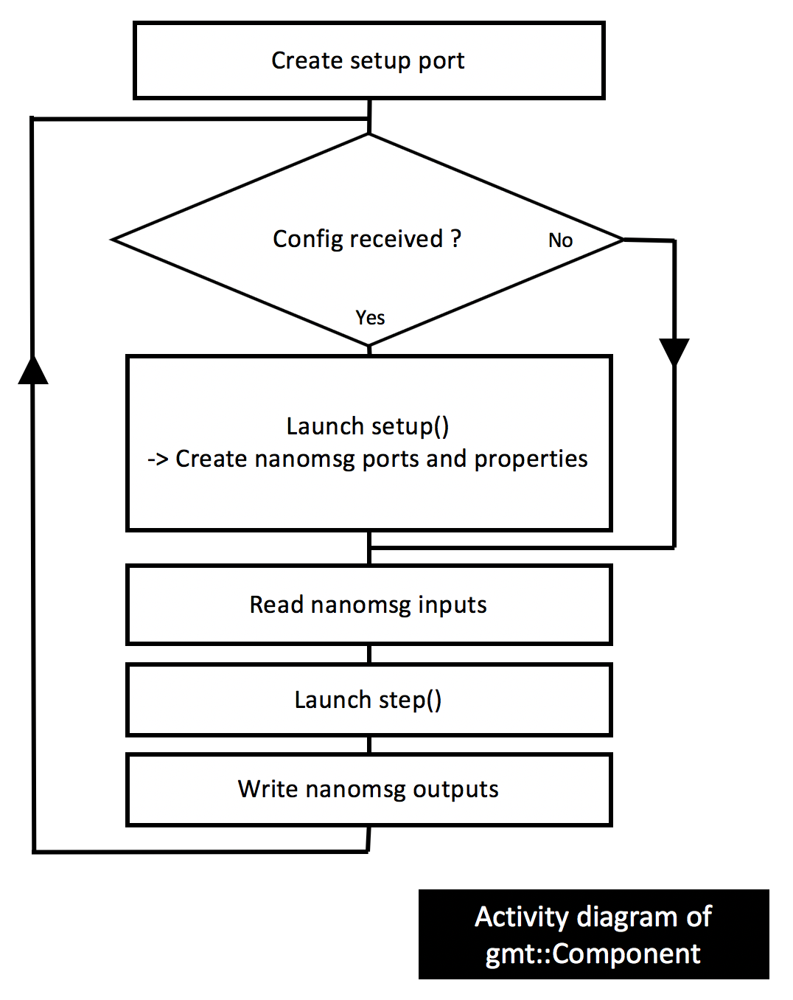

.. _io_fwk:

IO Framework
============
The IO framework contains the hardware adapter class definitions.
The hardware adapters are the components supporting the interface between the software *controlers* (derivated from *BaseControler* class) and the hardware devices via the physical networks (Ethernet for example).

Three adapters are already implemented: TCP/IP adapter, Ethercat adapter and Serial adapter.
Two other adapters are in progress: Serial-over-Ethercat adapter and OPCUA proxy.
Some other adapters will probably be developed to communicate with the instruments: CameraLink adapter, CoaXPress adapter, GigE Vision Adapter and USB3 Vision adapter.
Each adapter supports a specific communication protocol.
Some protocols are trivial: the serial consists in opening a socket and read/write raw data to a unique device across this socket. The pseudocode prototype of sending function is basic:
.. centered::
    SEND_SERIAL(VALUE)
The TCP/IP requests must be sent to a specific device:
.. centered::
    SEND_TCP-IP(VALUE to SERVER)
The most complex tasks such as multi-layer encapsulation and low-level data exchange are out of the IO framework scope. They are supported by the operating system (Linux Fedora) or by external libraries.
Some other protocols like Ethercat are more complex. The data must be addressed at a specific slave/module/server at a specific address:
.. centered::
    SEND_ETHERCAT(VALUE to SERVER at ADDRESS)
In that case a configuration file (CoffeeScript format) is necessary to link each data (client side) to its respective address (client side).
Finally, the OPCUA protocol is a little more complex to use:
.. centered::
    SEND_OPCUA(VALUE typed according TYPE-NODE to SERVER at PROPERTY of VARIABLE-NODE)

Common architecture of the adapters
---------------

All the C++ component classes used in the GMT subsystem control software derive (indirectly) from the class *gmt::Component* defined in the core framework. This base class supports the common features such as:
- The *nanomsg* communication (input and output ports) to make the component communicate with other components
- The component configuration and initialization (setup)
- The component runtime (*step*)
- The telemetry logs

Most of the *Component* function-members are pure virtual. They are declared in the *gmt::Component* base class but defined in each specific component. Thus, the functions *setup_wrapper()* and *step_wrapper()* are virtually declared and called in *gmt::Component* but defined in each child class.

The TCP/IP adapter
---------------

+-----------------------------------------------+
| General information about the TCP/IP adapter               |
+=======================+=======================+
| Progress status   | Implementation done            |
+-----------------------+-----------------------+
| Adapter Class name  | gmt::TcpIpHwAdapter                |
+-----------------------+-----------------------+
| Library used  | The TCP/IP communication doesn’t require any external library. The functions we use (socket(), read() and write()) are defined in native Linux libraries: netinet/in.h, sys/socket.h and unistd.h.               |
+-----------------------+-----------------------+

The TCP/IP adapter doesn’t contain port. This is the responsibility of the user to define ports in the adapter derived from *gmt::TcpIpHwAdapter*. The two only pieces of information are two *properties*: the *device_ip* address of the server/slave to connect and its *device_port* number.
The data stored in the variable *TcpIpHwAdapter::device_data_in* (string type) is sent on the network at every step. The data received from the network is stored in the variable *TcpIpHwAdapter::device_data_out* (string type). The maximum size of the data is limited by the constant *DEFAULT_BUFFLEN*.

The data is read and write every step if the operational state variable is equal to ‘*idle*’. The operational state variable is usually set to ‘*idle*’ state when the TCP/IP is connected to the slave/master is connected. If the TCP/IP adapter cannot find the server or cannot open the socket or cannot connect the server, then the adapter goes to the ‘*fault*’ state.

The Ethercat adapter
---------------

+-----------------------------------------------+
| General information about the Ethercat adapter               |
+=======================+=======================+
| Progress status   | Implementation done. Some minor changes might be added in the future depending on requirement of m1. |
+-----------------------+-----------------------+
| Adapter Class name  | gmt::EthercatAdapter                |
+-----------------------+-----------------------+
| Library used  | The ethercat adapter integrate an Ethercat master/client called “EtherCAT” and developed by Etherlab. The libray has not been maintained in the last 3 years. The last version we use (the last one) is EtherCAT master 1.5.2 .        |
+-----------------------+-----------------------+

Protocol and library overview
.............................

The Ethercat standard is an Ethernet protocol. The real-time computer executing the master is physically connected to the slaves/modules in a ring (redundant topology) via 2 ethernet ports. The originality and the strength of this protocol consist of its ability to organize the data communication between the master and several slaves in a unique frame. As a consequence, the Ethercat master can communicate with a a large number of slaves in the same time at high frequency. Thus, the master communicates with N slaves at a frequency = F Hertz using F frames. At the opposite, IP-based protocols (such as modbus/TCP, Ethernet/IP or Profinet) would need to encapsulate (N* F) frames.

The master identified each of the N slaves of the ring by its position (between 0 and N-1) and its *alias* (a unique 16-bit integer identifier set by the user)
>	The user can change the alias of any Ethercat module/slave this way:
 'ethercat alias -p 3 -f 123' or 'ethercat alias --position 3 --force 123'
 to set the alias 123 to the module located at the 3rd position in the ring

Each slave embeds a state machine to control its communication. The connection to the slave triggers the state change from *init* to *preop*. The configuration of the slave trigger from *preop* to *safeop*. Then the slave come to op and stay in this state to share PDOs (periodically) and SDOs (on demand) as long as the connection is established.

The data is organized in each Ethercat slave according to its *index* (uint16 from 0 to 65535) and its *sub-index* (uint8 from 0 to 255). The 2 elements of the address are generally written in hexadecimal and separated by a column (Ex: data1 @ 6001:03).
The data management split the *data objects* into 2 groups: the *Service Data Objects* (SDO) and the *Process Data Objects* (PDO). The PDOs are sent and received periodically and automatically depending on the frequency of the master. The SDOs are sent or received every time the user sends a request to do only.
The data_types supported by the Ethercat standard (and by the library) are:
  -	bool
  -	int8
  -	int16
  -	int32
  -	int64
  -	uint8
  -	uint16
  -	uint32
  -	uint64
  -	float
  -	double
  -	string
  -	octet_string
  -	unicode_string
The Ethercat adapter supports booleans and all numeric types only. If the user wants to read or write a string, they need to convert this string to (or from) a numeric type, by translating each character of the string by its ASCII code. Of course, the strings longer than 8 characters are never used (the longest type being int64 and uint64). Example: The user wants to write the string ‘hello’ to a slave:
[center]
+-----------+------------+
| Character | ASCII code |
+===========+============+
|     h     |    104     |
+-----------+------------+
|     e     |    101     |
+-----------+------------+
|     l     |    108     |
+-----------+------------+
|     o     |    111     |
+-----------+------------+
+----------+-------+-------+-------+-------+-------+-------+-------+-------+
| string   |   h   |   e   |   l   |   l   |   o   |       |       |       |
+----------+-------+-------+-------+-------+-------+-------+-------+-------+
| uint64   |   0   |   0   |   0   |  111  |  108  |  108  |  101  |  104  |
+----------+-------+-------+-------+-------+-------+-------+-------+-------+
[/center]
The user write ‘hello’ to the slave by sending it the value 30024610536 because:
    104 * (256^0)
  + 101 * (256^1)
  + 108 * (256^2)
  + 108 * (256^3)
  + 111 * (256^4)
  = 30,024,610,536

Implementation
..............

**Data object creation**
The PDOs and the SDOs are created by calling respectivally:
-	int ecrt_slave_config_reg_pdo_entry( ec_slave_config_t * sc, // Slave config
                                       uint16_t 		       entry_index,
                                       uint8_t             entry_subindex,
                                       ec_domain_t       * domain,
                                       unsigned int      * bit_position
                                      );

-	ec_sdo_request_t * ecrt_slave_config_create_sdo_request( ec_slave_config_t * sc, // Slave config
                                                    			 uint16_t            index,
                                                    			 uint8_t             subindex,
                                                   			   size_t              size 		// size in bytes
                                                         );

**Service Data Object (SDO) read/write**
The user can use the functions of Etherlab Ethercat library via command lines (command ethercat) or by calling the functions in a C++ program (#include <ecrt.h>).
  -	To send SDO
    o	By entering command line:
      $ethercat download -p <pos> <index> <subindex> <val>
    o By calling C++ function during master initialization:
      int ecrt_master_sdo_ ecrt_master_sdo_download( ec_master_t * master, 		    // EtherCAT master
                                                     uint16_t      slave_position,	// Slave position
                                                     uint16_t      index,			    // Index of the SDO
                                                     uint8_t       subindex,		    // Subindex of the SDO
                                                     uint8_t     * data,			      // Data buffer to download
                                                     size_t        data_size		    // Size of the data buffer
                                                     uint32_t    * abort_code		  // Abort code of the upload
                                                   );
    o By calling 2 C++ functions after master initialization:
    	First: EC_WRITE_<TYPE>() must be called
      	void EC_WRITE_<TYPE>( uint8_t		data_address,
                              <TYPE>		data_value
                            );
        “<TYPE>” must be replaced by the C++ type of the SDO data to send. The user can call: EC_WRITE_U8(), EC_WRITE_S8(), EC_WRITE_U16(), EC_WRITE_S16(), EC_WRITE_U32(), EC_WRITE_S32(), EC_WRITE_U64(), EC_WRITE_S64().
        .. note::
            EC_WRITE_BOOL(), EC_WRITE_FLOAT() and EC_WRITE_DOUBLE() don’t exist. Use respectively EC_WRITE_U8(), EC_WRITE_U32() and EC_WRITE_U64().
      Second: the buffer is set, now the user can send the SDO on the network by calling:
        void ecrt_sdo_request_write( uint8_t		data_address );
        .. note::
            Before calling the 2 functions, the user has to make sure the master is not busy:
            if( ecrt_sdo_request_state(data_address) != EC_REQUEST_BUSY ) {...}
  -	To receive SDO
    o	By entering command line:
      $ethercat upload -p <pos> <index> <subindex>
    o	By calling C++ function during master initialization:
      int ecrt_master_sdo_upload( ec_master_t * master, 		    // EtherCAT master
                                  uint16_t      slave_position,	// Slave position
                                  uint16_t      index,			    // Index of the SDO
                                  uint8_t       subindex,		    // Subindex of the SDO
                                  uint8_t     * target,			    // Target buffer
                                  size_t        target_size,		// Size of the target buffer
                                  size_t      * result_size,		// Uploaded data size
                                  uint32_t    * abort_code		  // Abort code of the upload
                                );
    o	By calling 2 C++ functions after master initialization:
    	First: ecrt_sdo_request_read() must be called
    		void ecrt_sdo_request_read( uint8_t data_address );
      Second: the buffer is read, now the user can read the SDO value by calling:
        void EC_READ_<TYPE> ( uint8_t data_address );
        “<TYPE>” must be replaced by the C++ type of the SDO data to send. The user can call: EC_READ_U8(), EC_ READ _S8(), EC_ READ _U16(), EC_ READ _S16(), EC_ READ _U32(), EC_ READ _S32(), EC_ READ _U64(), EC_ READ _S64().
        .. note::
            EC_WRITE_BOOL(), EC_WRITE_FLOAT() and EC_WRITE_DOUBLE() don’t exist. Use respectively EC_WRITE_U8(), EC_WRITE_U32() and EC_WRITE_U64().
        .. note::
            Before calling the 2 functions, the user has to make sure the master is not busy:
            if( ecrt_sdo_request_state(data_address) != EC_REQUEST_BUSY ) {...}

**Process Data Object (DDO) read/write**
PDOs are updated automatically and periodically. Nothing to do.

User interface
..............

.. figure:: ../_static/ethercat_interface.png
  :align: center

**Sending RX-SDOs**
The SDOs cannot be sent from the Ethercat adapter by default. To do so the user must set the boolean input sdo_write_enable to true. By the way, a SDO is sent the Ethercat ring as often the SDO value changes in the adapter (if the flag sdo_write_enable is on).

**Receiving TX-SDOs**
Sending SDOs can be done anytime. But receiving SDOs is possible when the user sends a request to the modules/slaves asking them for sending their SDO values to the master. To do that the user needs to set the flag sdo_read_update_req to true.
When the Ethercat receives all the SDOs from all the modules/slaves, the values are automatically updated and the flag sdo_read_update_done set to true. Then, the user (or the controller) has to set the flag sdo_read_update_req back to false.
To recap the process to update the SDOs from the slaves/modules to the adapter :
  1)	sdo_read_update_req <- true
  2)	Waiting…
  3)	The TX-SDO variables of the adapter are updated and the  sdo_read_update_done automatically set to false
  4)	sdo_read_update_req <- false

**Sending RX-PDOs and receiving TX-PDOs**
The user has nothing to do. The PDOs are sent and received automatically depending on the frequency of the master.

**Getting the Ethercat state of the slaves/modules**
When the user wants to know the Ethercat state (op, preop or safeop) of a module of the Ethercat ring, he or she sends the position of the module on slave_state_req input port. The output port slave_state_result returns the code of the module state according to Ethercat standard:
   - 1: INIT
   - 2: PREOP
   - 4: SAFEOP
   - 8: OP
If there is no module at  the position entered in slave_state_req or if the state is not received yet, then slave_state_result returns -1.

The Serial Adapter
------------------

+-----------------------------------------------+
| General information about the Serial adapter   |
+=======================+=======================+
| Progress status   | Implementation done. Some minor changes might be added in the future depending on requirement of the instruments. |
+-----------------------+-----------------------+
| Adapter Class name  | gmt::SerialAdapter                |
+-----------------------+-----------------------+
| Library used  | The ethercat adapter integrate an Ethercat master/client called “EtherCAT” and developed by Etherlab. The libray has not been maintained in the last 3 years. The last version we use (the last one) is EtherCAT master 1.5.2 .              |
+-----------------------+-----------------------+

.. figure:: ../_static/serial-interfaceinterface.png
  :align: center
The interface of the serial adapter contains one data input (*device_data_out*) and one data output (*device data_in*). A third port called RTS controls the *RTS* bit. This bit is used on old serial devices only.
Two properties must be set by the user:
-	*port_file_path*: a string property setting the full path of the serial file. Its default value is the path of the serial file on RTC3: '/dev/ttyS0'
-	*baud_rate*: the frequency of the serial communication. Its type is not numeric but a string. These are its possible value: ‘B50’, ‘B75’, ‘B110’, ‘B134’, ‘B150’, ‘B200’, ‘B300’, ‘B600’, ‘B1200’, ‘B1800’, ‘B2400’, ‘B4800’, ‘B9600’, ‘B19200’, ‘B38400’, ‘B57600’ and ‘B115200’.

The value set on the input port *device_data_out* is sent to the serial file at every step. However, the baud rate of the serial communication can be slower than the frequency of the component. In that case the value cannot be sent to the serial device at every step.
Similarly, the value received from the serial device is copied on the output port *device_data_in*. The size of the received vale is limited by the constant *BUFFLEN* defined in *serial_adapter.h*.
The only supported type is the string type. This limitation is acceptable for our use case. If the user wants to send or receive another type, the cast to/from string is their responsibility.

The Serial-over-Ethercat Adapter
-----------------------------

+-----------------------------------------------+
| General information about the Serial-over-Ethercat adapter   |
+=======================+=======================+
| Progress status   | Implementation in progress            |
+-----------------------+-----------------------+
| Adapter Class name  | gmt::SerialOverEthercatAdapter                |
+-----------------------+-----------------------+
| Library used  | Etherlab Ethercat              |
+-----------------------+-----------------------+

The Serial-over-Ethercat adapter derives from the Ethercat adapter.
The purpose of this feature consists in controlling serial devices (RS232) using Ethercat protocol via Ethercat slaves/modules making the translation between serial and Ethercat.
At the opposite of the point-to-multipoint RS485, the RS232 protocol is a point-to-point (P2P) protocol. That means each serial port of the computer (master/client side) cannot be connected to more than one device (slave/server side).  Imagine N serial devices must be connected to the real-time computer. This requirement would cause 3 issues:
-	If N is bigger than one, we cannot connect the N serial devices to the same computer because the computers we use have only one physical serial port.
-	The second issue is about the wiring between the central computer in the cabinet and the serial devices embedded in the instruments. The N serial devices must be physically connected to the computer using N serial cables since the RS232 communication cannot be multiplexed in the same cable.
-	The distance between the central computer and the serial devices can be big (dozens of meters). But the serial communication is accurate up to some meters only. According to Wikipedia, the RS232 communication distance cannot be bigger than 2.6m at 56000 bauds.
The direct serial connection between the computer and the serial devices is not possible because of these 3 reasons. As a consequence, the Beckhoff 6002 Ethercat slave/module is set between the computer and the serial devices. Ethercat protocol supports point-to-multipoint (P2MP) and long-distance communication unlike Serial.
The Beckhoff 6002 Ethercat module contains 2 Ethernet ports (like all the other Ethercat modules) to connect it to the other modules in the Ethercta ring. Plus 2 serial/RS232 ports to connect up to 2 serial devices per module. Some parameters like the baud rate are set using SDOs.
`Beckhoff EL6002 module documentation <https://download.beckhoff.com/download/document/io/ethercat-terminals/el600x_el602xen.pdf/>`_.

The Etherlab Ethercat library offers a feature to communicate with 6002 modules via a virtual serial terminal (located at “/dev/ttyEC0”). As a consequence, the user transparently communicates with their RS232 device using a GMT Serial Adapter.
This feature must be installed with the following commands:
.. code-block:: bash
  ./configure --with-linux-dir=/your/linux/directory --enable-tty
  make all modules
  make modules_install install
  rcethercat start
  insmod tty/ec_tty.ko
  insmod examples/tty/ec_tty_example.ko
The default settings for the serial line are 9600 8 N 1.
Then testing:
.. code-block:: bash
  echo "Hello World" > /dev/ttyEC0
The interface between the user and the Ethercat protocol is supported by a Linux kernel module (ec_tty.ko). Unfortunately, this module is not compatible with our version of our Linux kernel (Linux freezes when data is written on /dev/ttyEC0). The kernel module must be fixed. That’s why the Serial-over-Ethercat adapter is not finished yet.

The OPCUA Proxy
---------------

+------------------------------------------------+
|  General information about the OPCUA proxy     |
+====================+===========================+
| Progress status    | Implementation in progress|
+--------------------+---------------------------+
| Adapter Class name | gmt::OpcuaProxy           |
+--------------------+---------------------------+
| Library used       | Open62541                 |
+--------------------+---------------------------+
